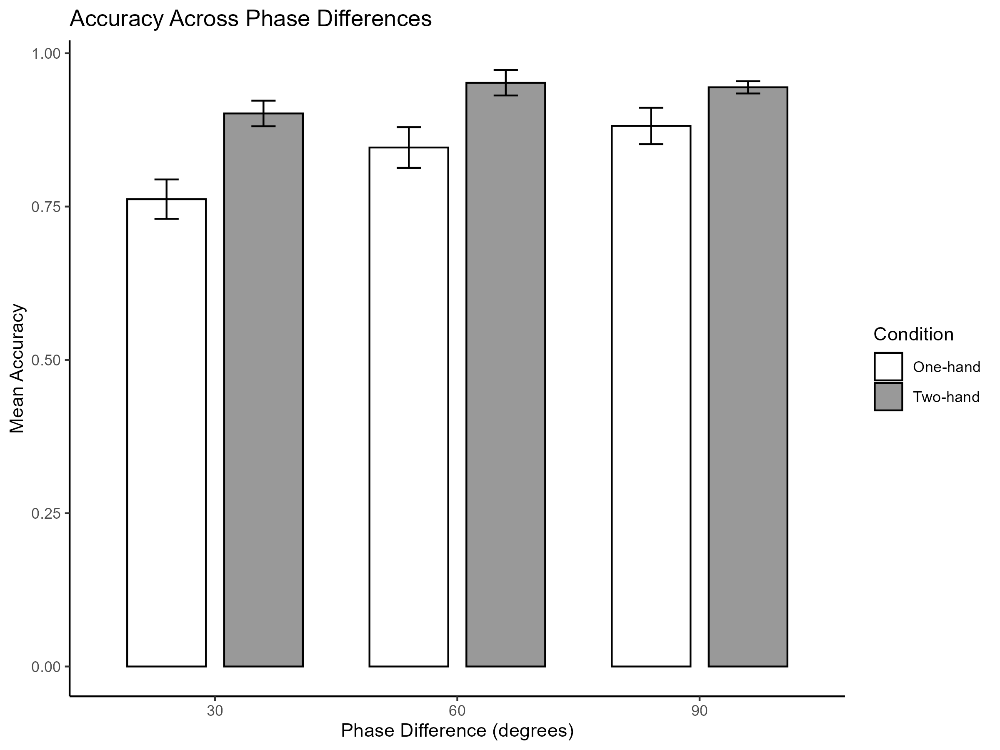
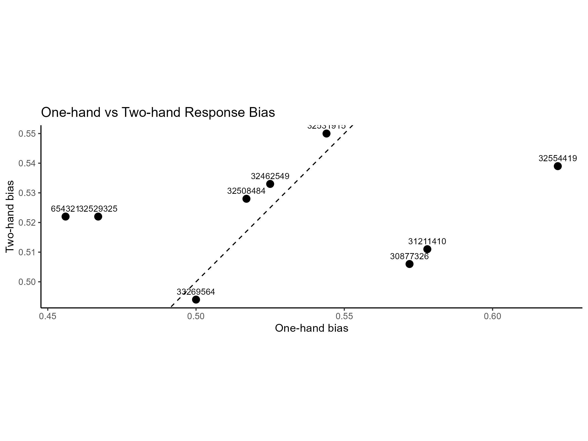

# Sensorimotor Phase Analysis

## Project Overview
This project analyzes behavioral performance in a sensorimotor experiment comparing one-hand and two-hand conditions across phase differences of 30°, 60°, and 90°.

The original trial-level dataset was not available when this repository was reconstructed. Therefore, the included CSV files are reconstructed summary tables based on prior R analysis outputs.

## Data
The `data/` folder contains:

- `accuracy_summary.csv` — reconstructed subject × condition × phase accuracy table
- `bias_data.csv` — reconstructed one-hand vs two-hand response bias table
- `permutation_results_reconstructed.csv` — reconstructed permutation-test output table

## Methods
- Accuracy comparison across one-hand and two-hand conditions
- Phase-level performance comparison
- Response bias analysis
- Paired t-test on response bias
- Bar plots with standard error
- Scatter plot comparing one-hand and two-hand bias

## Tools
- R
- dplyr
- tidyr
- ggplot2

## Important Note
Because the original trial-level dataset is missing, this repository should be interpreted as a reproducible reconstruction of the analysis workflow based on available summary outputs, not as a full reproduction from raw experimental data.

## Key Interpretation
Two-hand conditions generally showed higher accuracy than one-hand conditions across phase differences, while response bias differences were smaller and varied across participants.

## Figures

### Accuracy Across Phase Differences

### One-hand vs Two-hand Response Bias

